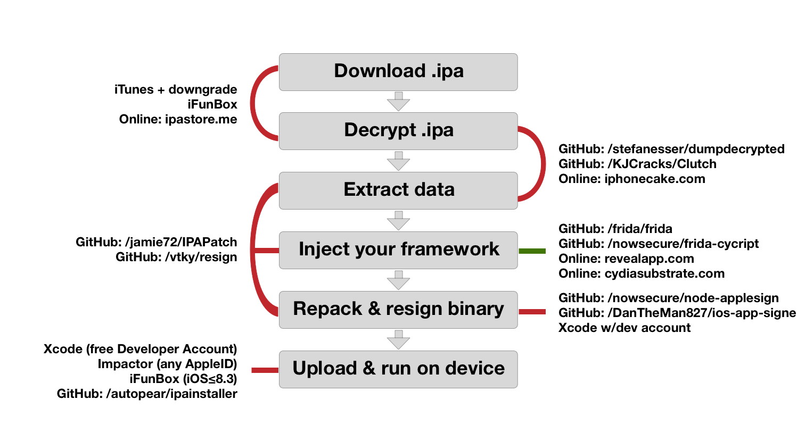

# iOS Pentest methodology

## Prerequisites

- The best case is that you have both, the source code and the builded IPA. Then it will be easier to perform the penetration tests but is is not often the case;
- Second case will to have the IPA on debug mode obtained with XCode by selectionning the compilation options;
- Otherwhise, on real black box, you will need to download the application on the Apple store with a jailbroken iDevice. Indeed, the application available on the store is encrypted and signed;
- It is also possible to retrieve the IPA on this site for example too: https://www.iphonecake.com/.

## IPA folder structure

In order to identify the folders installed by an application you can use installipa on a jailbroken iDevice.
Here is the command to know:

```
installipa -l : liste les applications installées
installipa -i app.ipa : affiche les informations complète de l'application app.ipa
```

Otherwhise with objection you can use the command: `env`, that display directory information for the current application environment. On iOS devices, this includes the location of the applications bundle, the Documents/ and Library/ directory.

Principally, there are 2 paths to know:

- Bundle: `/private/var/mobile/Containers/Bundle/Application/`

  The Bundle folder will contain the executable binary of the application.

- Data: `/private/var/mobile/Containers/Data/Application/`

  It will store all the user data and others. It will have 3 folders:

  - Documents: which stores the user data;
  - Library: which contains the configuration, preferences, cookies, catches and plist files;
  - Temp: where temporary files will be stored.

## Web proxy avec burp

 - https://support.portswigger.net/customer/portal/articles/1841150-Mobile%20Set-up_Ad-hoc%20network_OSX.html
 - https://support.portswigger.net/customer/portal/articles/1841108-configuring-an-ios-device-to-work-with-burp
 - https://support.portswigger.net/customer/portal/articles/1841109-Mobile%20Set-up_iOS%20Device%20-%20Installing%20CA%20Certificate.html

## SSH connection

- For linux install the following packets: `apt-get install libusbmuxd-tools libimobiledevice-utils`

- For OS X: `brew install libimobiledevice`

- First on one shell type: `iproxy 2222 22`

- Then on a second shell: `ssh root@127.0.0.1 -p 2222` (The default password for iOS is: **alpine**)

## Extract IPA on a jailbroken iDevice

https://github.com/AloneMonkey/frida-ios-dump

## Static analysis

It is possible to perform a first analysis step with automated tools. With a short and fast check, it is important to verify:

- The configuration options;
- the permissions;
- the info.plist file:
- The strings;
- etc.

### MobSF

You can download the git project on: https://github.com/MobSF/Mobile-Security-Framework-MobSF

Then you can load it with the following command: `sudo python3 manage.py runserver`.

It will launch a Web application accessible on: http://127.0.0.1:8000/.

### Fufluns

https://github.com/wargio/fufluns

## Hopper and IDA

For advanced reverse, it is possible to disassemble the IPA with Hopper or IDA. 

It is necessary first to have the IPA not encrypted. Then you have to unzip the IPA and dissassemble the binary on the Payload folder before loading it on Hopper.

#### tools

 - https://github.com/techbliss/Frida_For_Ida_Pro
 - https://github.com/nowsecure/r2frida

## Frida server on jailbroken iDevice

if you have a jailbroken device with Cydia, first you have to add the frida repository on your source: https://build.frida.re. Then you should be able to find and install frida server.
Now you have a frida server running on your iOS device and can use Frida, Objection, Passionfruit and other related tools.

## Patching, repacking and signing an IPA

This method allow to patch an IPA by including FridaGadget on it with a Mac laptop. For patching an IPA it is mandatory to have a Mac OS X system, then once the app is patched, it is possible to use it with a linux desktop for further analysis.

If you don't want to purchase a annual Mac developer licence, Apple allows to generate a development profile for free but valid for only 7 days (Then you'll have to rebuild your IPA, again).

In order to list all your developer certificate available on your Mac you can use the following command:

```
security find-identity -p codesigning -v
```



### Method 1: resign

Download the github project: https://github.com/vtky/resign

Then load the XCode project: `resign.xcodeproj`

On the compilation configuration modify the `bundle identifier` then select your itunes account in `Signing Team`.

- Drop the IPA to patch on the folder  `ipa_to_resign`
- Drop the dylib to inject (frida lib) on the folder `dylibs_to_insert`
- Compile the project `Command + B` or `Product > Build`

Then on the iDevice you have to verify the application, for that go to: `Settings > General > Profil and peripherics > [itunes account] > Verify the application` 

Demonstration available: https://vimeo.com/237924702

Now, when you load the application on the iDevice you are prompted a blank page. You have to open a terminal and load frida: `frida -U gadget`

### Method2: Objection

One of the top tools for performing mobile penetration tests is Objection (https://github.com/sensepost/objection).

#### Preparation (Every 7 days if you have a free dev licence)

First you have to generate an  `embedded.mobileprovision` file on `~/Library/Developer/Xcode/DerivedData/`.

For this purpose, launch XCode and create a new blank project (iOS -> Single View Application). Then on the `General`panel on the `Signing`section make sure that you have selected your developer profile.

Now you can plug your iDevice on the Mac and build the application on your iDevice.

#### IPA Patching
Now you can easily patch the IPA with the following command:

```objection patchipa --source my-app.ipa --codesign-signature 7D1EA3BC9xxxx```

Remember that the codesign-signature can be retrieve with the following command:

```security find-identity -p codesigning -```

#### IPA execution and live debugging

Once you have patched the IPA, you have to unzip it:  `unzip my-app.ipa`, then go on the `Payload/` folder.


First you have to install the IPA on the iDevice:
```
ios-deploy --bundle Payload/my-app.app
```

Then, you should encounter an error message telling you that you have to verify the developer if it is your first installation (every 7 days for free licence). For that go to: `Settings > General > Profile and device management > Application > Trust`

Now you can launch the patched IPA on your iDevice through your Mac OS X with the following command:

```
ios-deploy --noinstall --bundle Payload/my-app.app -W -d
```

Finally, on another terminal launch objection: `objection explore`

### Other methods

Otherhwhise there is ton of methods to try:
 - https://github.com/jamie72/IPAPatch
 - https://github.com/tanprathan/Fridpa

## Frida for iOS

### Installation

On your laptop install frida:  `pip3 install --user frida`

### Usage
Now you can interact with your frida-server or patched IPA with the following commands:

 - `frida -U gadget`: allow to launch the patched IPA
 - `frida-ls-devices`: list all devices available with Frida
 - `frida-ps -U`: List the process of the device connected on USB
 - `frida-trace -U -i "*{string}*" com.package.totrace`: Trace the  execution of the methode *{string}* on the application com.package.totrace
 - `frida -U -f com.package.totrace`: Tracing of the application com.package.totrace on cli
 - `frida -U -l javascript.js com.package.totrace`: Execute the code of  javascript.js on the application com.package.totrace

### Examples

The following code allows to attach on the function **read**, modify its arguments and show their values:

```javascript
Interceptor.attach(Module.findExportByName(null, 'read'), {
    onEnter: function (args) {
        // Display the context
        console.log('Context information:');
        console.log('Context  : ' + JSON.stringify(this.context));
        console.log('Return   : ' + this.returnAddress);
        console.log('ThreadId : ' + this.threadId);
        console.log('Depth    : ' + this.depth);
        console.log('Errornr  : ' + this.err);

        // Backtrace
        console.log("Called from: \n" +
            Thread.backtrace(this.context, Backtracer.ACCURATE)
            .map(DebugSymbol.fromAddress).join("\n") + "\n");

        // Save arguments for processing in onLeave.
        this.fd    = args[0].toInt32();
        this.buf   = args[1];
        this.count = args[2].toInt32();
    },
    onLeave: function (result) {
        console.log('----------')
        // Show argument 1 (buf), saved during onEnter.
        numBytes = result.toInt32();
        if (numBytes > 0) {
            console.log(hexdump(this.buf, { length: numBytes, ansi: true }));
        }
        console.log('Result   : ' + numBytes);
    }
})
```

### Frida scripts

 - https://github.com/dweinstein/awesome-frida
 - https://github.com/coolx28/frida-scripts/tree/master/iOS

## Analysis with Objection

Once the patched IPA is installed on the iDevice, it is possible to launch it on debug mode:
```
ios-deploy --noinstall --bundle Payload/my-app.app -W -d
```

On a second terminal connect to objection: `objection explore`. If you are using a jailbroken device, add the option -g with the name of the application process.

Here is some exemple of command that you can do with objection:

 - `env`: list all folders used by the application 
 - `ios plist cat fichier.plist`: print the content of a plist file
 - `sqlite connect db.sqlite`, `sqlite execute schema` and `sqlite execute query select * from [data];`: interact with a sqlite database 
 - `ios hooking list Classes/class_methods [Class]`: list methods and classes
 - `ios hooking search classes [Class]`: search the  class [Class]
 - `ios hooking set_method_return [ClassName MethodName]`: perform on the following method
 - `ios keychain dump` : Dump keychain
 - etc.


## Analysis with Passionfruit

Passionfruit allows to perform the same tests as objection but with a Web GUI.

You can install and launch it with the following commands:
```
npm install -g passionfruit
passionfruit
```

Once you have the patched IPA with frida lib or frida server running on your iDevice, launch passionfruit. Then the Web interface is accessible by default on: http://localhost:31337.

## Webview

On iOS its exist 2 types of WebView:

- UIWebView: Which is deprecated and vulnerable to many vulnerabilities; 
- WKWebView: The new WebView which is hardened.

It is possible to monitor the called WebView with the following script:

```
frida --codeshare mrmacete/objc-method-observer -n {appName} -U
```

Then search for some interesting things: 

- For UIWebView:
  - `observeSomething("*[* webView:shouldStartLoadWithRequest*]")`;
  - `observeSomething("*[* stringByEvaluatingJavaScript*]")`;

- For WKWebView:
  - `observeSomething("*[WKScriptMessage body]")`;
  - `observeSomething("*[* evaluateJavaScript*]")`;

## Remote debug iOS Webkit with Safari

- First you need to active on your iDevice the Web Inspector: `Settings > Safari > Advanced > Web Inspector`

- On your Mac on Safari activate the developer options;

- Then with the Safari Browser of your Mac go to: Develop > iDevice > Inspect WebView.

## Remote debug iOS With linux

https://github.com/RemoteDebug/remotedebug-ios-webkit-adapter